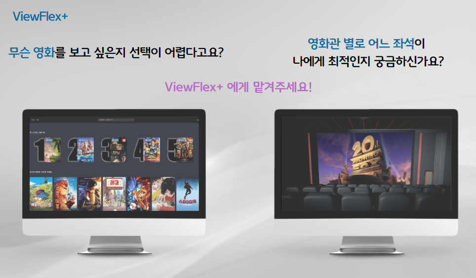
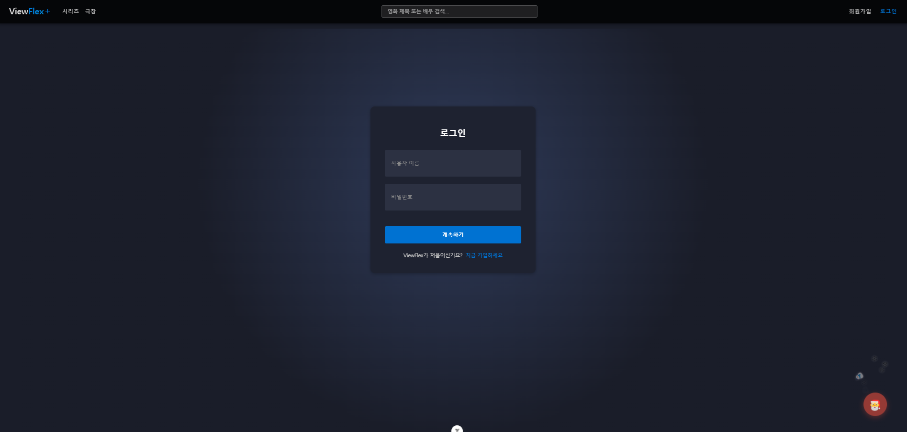
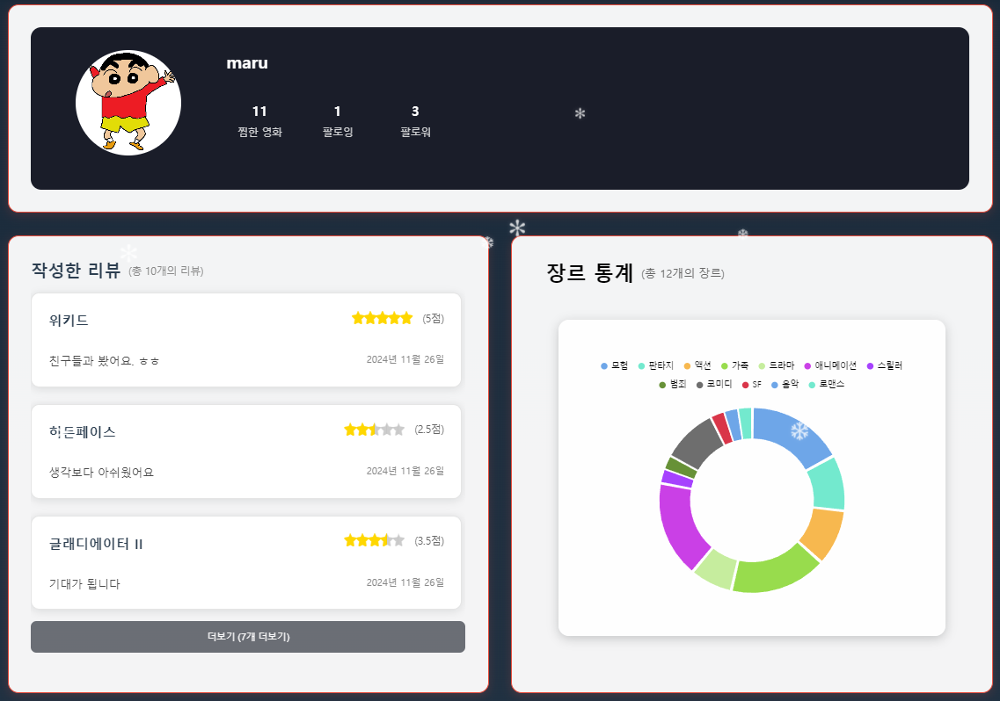
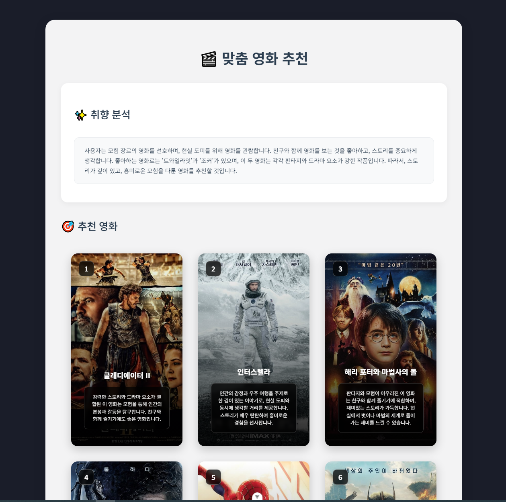
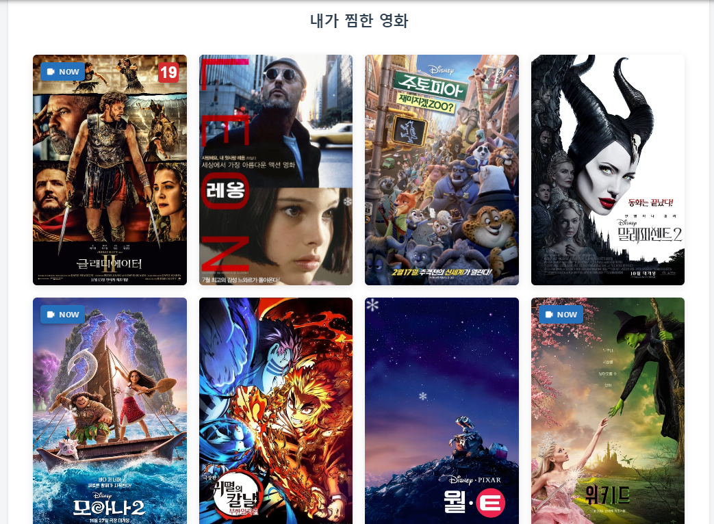
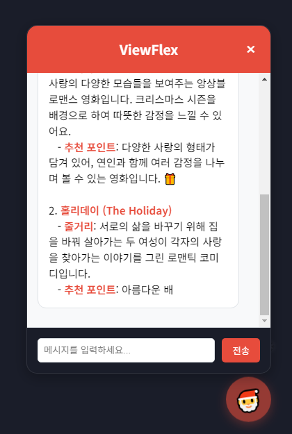
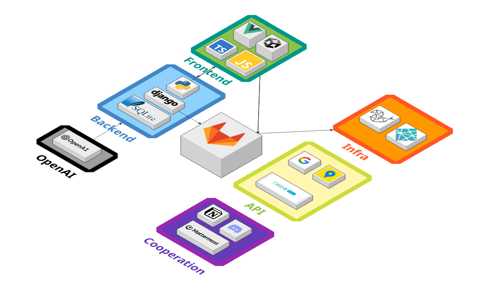
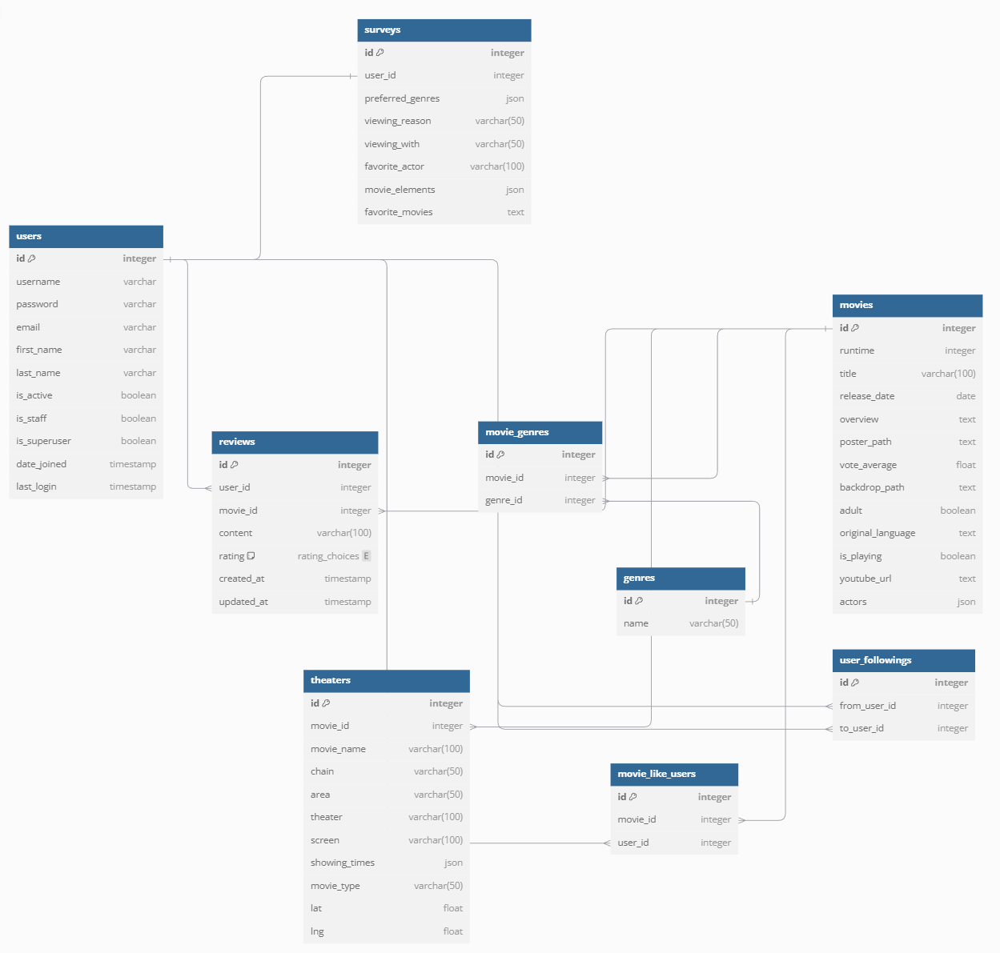

  <h1 style="color:rgb(120, 147, 255);">ViewFlex+</h1>
  
🎬 내 맘에 쏙! 똑똑한 영화 추천 및 영화관 좌석 체험 서비스 🎬

 

    

## ✍️ 프로젝트 개요

- **프로젝트명:** ViewFlex+
- **프로젝트 기간:** 2024.11.18 ~ 2024.11.26
- **SSAFY 12기 관통 프로젝트 최우수상 🏆**

---

## 📢 프로젝트 소개

### 프로젝트 배경

최근 OTT(Over-The-Top) 서비스의 성장과 극장 개봉 영화의 다양화로 인해 관객들은 어떤 영화를 선택할지 고민하는 경우가 많아지고 있습니다. 
특히, 다양한 장르와 플랫폼에서 수많은 영화가 제공되면서 개인별로 취향에 맞는 영화를 찾기가 어려워지고 있으며, 사용자 맞춤형 추천이 부족한 상황입니다.

또한, 영화관별 좌석 환경이 다르기 때문에, 좌석 선택에 어려움을 겪는 관람객이 증가하고 있습니다. 좌석 위치, 시야각, 스크린 크기 등이 영화 감상에 큰 영향을 미치지만, 현재는 이를 사전에 체험해볼 수 있는 방법이 없습니다. 특히, 개인의 키에 따라 최적의 좌석이 달라질 수 있지만, 이를 고려한 좌석 선택이 어려운 현실입니다.

이러한 문제를 해결하기 위해, Unity 기반의 영화관 좌석 체험과 AI를 활용한 사용자 맞춤 영화 추천 서비스를 개발하고자 합니다.

---

## 🚀 프로젝트 목표

1. **🎥 AI 기반 영화 추천 기능 제공:** 
    - 영화 선택에 어려움을 겪는 사용자들을 위해 AI를 활용한 맞춤형 영화 추천 시스템을 제공합니다. 
    - 비로그인 사용자는 랜덤 추천을 통해 다양한 영화를 탐색할 수 있으며, 로그인 사용자는 AI가 학습한 데이터 기반의 초개인화 추천 서비스를 이용할 수 있습니다. 
    - 로그인 사용자의 추천 시스템은 개인의 선호도를 반영하여, 사용자가 좋아요한 영화들의 상위 3개 장르를 분석해 추천하거나, 팔로우한 친구들이 좋아하는 영화를 기반으로 추천합니다. 
    - 사용자가 본 영화에 출연한 배우들의 다른 작품을 추천하며, 좋아요 또는 높은 평점을 준 영화들의 개봉 연도를 분석해 과거 선호도를 반영한 영화 추천 기능도 제공합니다. 이 추천 시스템은 TMDB API 및 AI 모델을 활용하여 사용자 취향을 분석하고, 장르, 배우, 개봉 연도 등의 요소를 반영한 정밀한 추천을 수행합니다. 사용자는 이를 통해 보다 쉽게 본인의 취향에 맞는 영화를 찾을 수 있으며, AI 기반의 지속적인 학습을 통해 추천의 정확도가 점점 향상됩니다.

2. **🎭 Unity 기반 영화관 좌석 체험 기능 제공:** 
    - Unity를 활용하여 각 영화관의 좌석을 가상 환경에서 체험할 수 있도록 구현합니다. 
    - 영화관의 상영관 구조를 미리 확인하고, 사용자가 스크린에 재생되는 영화 예고편을 관람하며 좌석을 체험하여 실제 관람 시 최상의 경험을 누릴 수 있도록 지원합니다.

3. **🎬 실시간 영화 정보 제공:** 
    - 현재 인기 있는 영화 및 OTT 콘텐츠를 분석하여 실시간으로 영화 정보를 제공합니다. 
    - 최신 개봉작, OTT 인기 작품, 사용자 평가 등을 종합하여 영화 선택을 돕습니다.

## 📊 기대 효과

### 플랫폼
- **사용자 맞춤형 영화 추천 시스템 제공**: AI 기반 추천 알고리즘을 통해 사용자의 선호도를 분석하고, 보다 개인화된 영화 추천 서비스를 제공합니다. 이를 통해 사용자는 자신의 취향에 맞는 영화를 쉽게 발견할 수 있으며, 플랫폼은 보다 높은 사용자 만족도를 확보할 수 있습니다.
- **데이터 기반의 지속적인 추천 정확도 향상**: 사용자들의 좋아요, 리뷰, 시청 기록 등을 학습하여 추천 모델이 지속적으로 개선되며, 이를 통해 추천 정확도를 점점 향상시킬 수 있습니다.
- **영화관 좌석 체험 서비스 제공**: Unity 기반의 가상 체험 시스템을 통해 사용자들이 영화관의 실제 좌석 환경을 사전에 확인할 수 있으며, 플랫폼은 이를 차별화된 기능으로 활용하여 경쟁력을 강화할 수 있습니다.

### 사용자
- **개인 취향에 맞는 영화 추천 서비스 제공**: 단순 인기 순위 기반이 아닌, 사용자의 좋아요, 선호 장르, 팔로우한 친구의 취향, 시청한 배우의 다른 작품 등을 반영한 추천 기능을 제공하여 보다 만족스러운 영화 탐색 경험을 제공합니다.
- **맞춤형 좌석 추천을 통한 최적의 영화 관람 경험 제공**: 영화관 별 좌석 구조를 개인의 키와 시야각을 고려하여 가상으로 체험하고, 실제 관람 시 더욱 몰입감 높은 영화 감상 환경을 조성할 수 있습니다.
- **영화 선택 고민 해소**: AI가 자동으로 추천하는 초개인화 영화 추천 기능을 통해 사용자는 더 이상 어떤 영화를 볼지 고민할 필요 없이 최적의 영화를 빠르게 선택할 수 있습니다.
- **실시간 영화 정보 탐색 용이**: 최신 개봉작, OTT 인기 콘텐츠, 사용자 리뷰 및 평점 등을 한눈에 확인할 수 있어, 트렌드에 맞춘 영화 관람이 가능합니다.

---

 ## 📌 주요 기능

### 1️⃣ <b>메인 페이지</b>
> 메인 페이지

|                        **Login Home Page**                        |
| :---------------------------------------------------------: |
|  |

|                       **Logout Home Page**                        |
| :---------------------------------------------------------: |
|  |

 

### 2️⃣ <b>회원가입 페이지</b>

> 회원가입 페이지

|                        **Signup Page**                        |
| :---------------------------------------------------------: |
|  |

|                       **Login Page**                        |
| :---------------------------------------------------------: |
|  |

 

### 3️⃣ <b>검색 페이지</b>

> 검색 페이지

|                      **Search Page**                      |
| :--------------------------------------------------------: |
|  |

 

### 4️⃣ <b>영화 상세 페이지</b>

> 영화 상세 페이지

|                      **Movie Detail Page**                      |
| :--------------------------------------------------------: | 
|  |

 

### 5️⃣ <b>극장 검색 페이지</b>

> 극장 검색 페이지

|                      **Cinema Search Page**                      |
| :--------------------------------------------------------: | 
|  |

 

### 6️⃣ <b>극장 체험 페이지</b>

> 극장 체험 페이지

|                      **Cinema Simulation Page**                      |
| :--------------------------------------------------------: | 
|  |

 

### 7️⃣ <b>마이 페이지</b>

> 마이 페이지

|                      **My Page**                      |
| :--------------------------------------------------------: |
|  |

|                      **My Page - AI**                      |                      **My Page - MyLike**                      |                 
| :---------------------------------------------------------: | :---------------------------------------------------------: |
|  |  | 
 

### 8️⃣ <b>챗봇</b>

> 챗봇

|                      **ChatBot**                      |                      **ChatBot**                      |                 
| :---------------------------------------------------------: | :--------------------------------------------------------: | 
|  |  |
 

---

## 🧑‍💻 팀원 소개

|  |  |
|:----------:|:----------:|
| **권정민** | **제갈민** |
| 팀장 & Infra & Full Stack | Full Stack |

---

## ⚙️ 기술 스택

<table>
    <thead>
        <tr>
            <th>분류</th>
            <th>기술 스택</th>
        </tr>
    </thead>
    <tbody>
        <tr>
            <td>프론트</td>
            <td>
                
                
            </td>
        </tr>
        <tr>
            <td>백엔드</td>
            <td>
                
            </td>
        </tr>
        <tr>
            <td>데이터베이스</td>
            <td>
                
            </td>
        </tr>
        <tr>
            <td>AI</td>
            <td>
                
            </td>
        </tr>
        <tr>
            <td>인프라</td>
            <td>
                
                
            </td>
        </tr>
        <tr>
            <td>API</td>
            <td>
                
                
                
            </td>
        </tr>
        <tr>
            <td>협업 도구</td>
            <td>
                
                
                
                
            </td>
        </tr>
    </tbody>
</table>

---

## 🔨 시스템 아키텍처

---

## 📊 ERD

